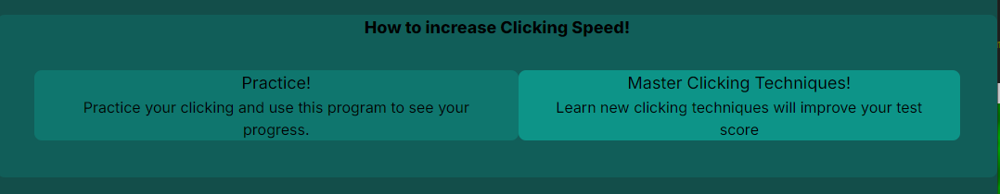
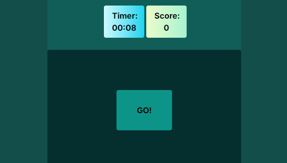
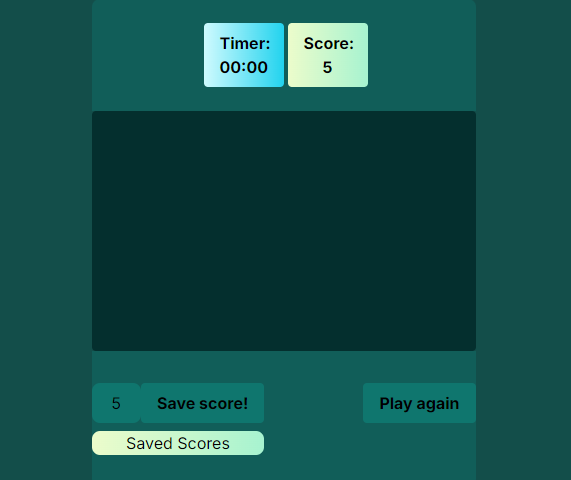
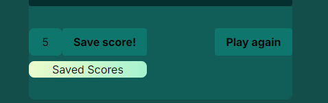
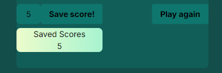
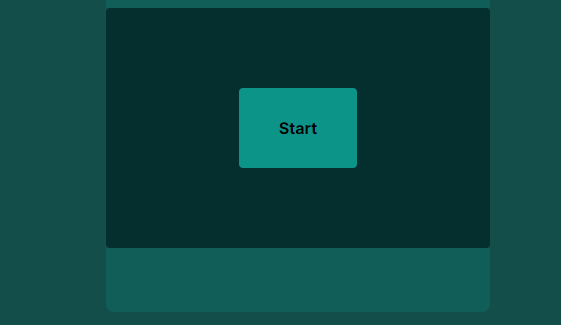
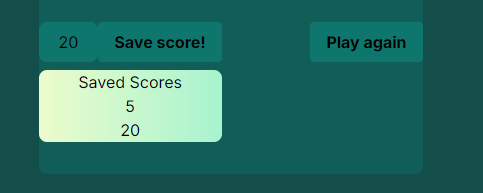

Header and subtitle

Some content with text in bottom of page

Timer that is sett to 10 seconds and a score keeper that is set to 0 when start the game

Start button, when click on start button, another button shows and can be clicked until timer sets to 0

When timer is 0 Go button is now not showing instead score is showing how many times the user pressed the button

It will also show the score, save score button, play again button and the saved score scoreboard.

IF player press save button. The score is saved to the scoreboard

IF the user press the play agin button the start button will show, and the save score, play agin button is hidden. Also the scoreboard will be hidden

Now the game starts over and next time time is up save score, play again, and result will show again. You are also able to see your old score in the score board

