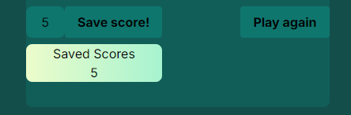
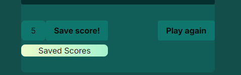

Header With Subtitle

Some content with text in bottom of page

Timer that is sett to 10 seconds and a score keeper that is set to 0 when start the game

Start button, when click on start button, another button shows and can be clicked until timer sets to 0

When timer is 0 button not showing and score is now showing how many times the user pressed the button

At same time as the button is hidden two other buttons turns up, Save score and play again. It will also show the users
clicked result. The save score board will also show:

IF user press save score button the amount of click will be saved to the save score keeper

If user press play again button, the score board will be hidden and start button will aper

